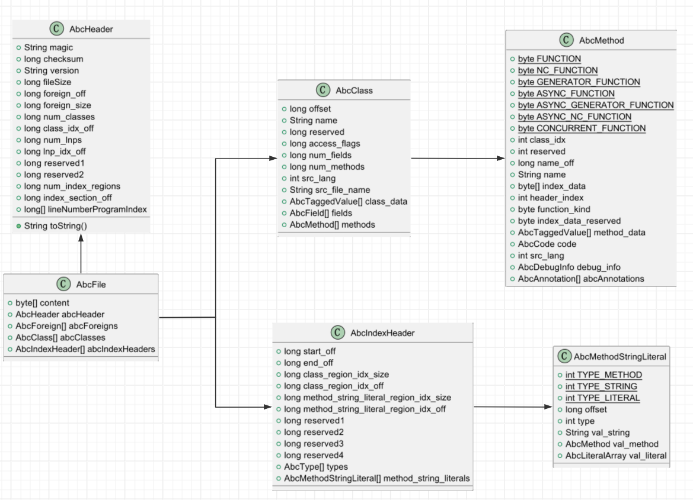

# GetFromAbc

该项目用于实现从.abc文件中提取类(class 或 record)、方法(method)信息

## 0 说明

本项目依据方舟字节码文件格式，解析.abc文件结构，使用ReadUtil类提供接口，目的在于提前解析一部分abc文件中压缩后的classe、method信息，以供后续静态程序分析、安全检查使用

##### 相关链接

https://developer.huawei.com/consumer/cn/doc/harmonyos-guides-V5/arkts-bytecode-file-format-V5 方舟字节码文件格式(abc文件格式)

https://gitee.com/openharmony/arkcompiler_runtime_core/tree/master 方舟运行时公共组件(主要使用反汇编工具ark_disasm做一些验证)

## 1. 类说明

### 1.1 **src\model**

该文件夹下的类是abc文件中存储的主要数据结构

### 1.2 **src\ReadUtil.java** 

该类为主要工具类，以下为使用接口说明：

* **public static AbcFile parseAbcFile(String filePath)**

  * **说明**：该方法为使用入口，用于解析abc文件，并保存文件结构。该类全部使用静态方法和属性，在使用时先调用**parseAbcFile**方法读取abc文件，**parseAbcFile**执行后该类静态属性abcFile中即存储解析后的文件结构，之后调用该方法后才能使用后面的字符串查找方法

  * **输入**：要解析的.abc文件路径

  * **输出**：返回解析后的abc文件数据结构， 类型为AbcFile

  * **使用示例**：

    ```java
    public class Main {
        public static void main(String[] args) {
            String filePath = "../modules.abc";
            AbcFile abcFile = new AbcFile();
            try {
                ReadUtil.parseAbcFile(filePath);
                abcFile = ReadUtil.abcFile;
                filePath += "";	//可以在该行打断点，debug查看abcFile结构
            } catch (IOException e) {
                e.printStackTrace();
            }
        }
    }
    // 具体的，可以通过abcFile.abcClasses[index1].methods[index2]
    // 查看第index1个类的第index2个方法
    // 
    // 通过abcFile.abcIndexHeaders[0].method_string_literals[index1]
    // 查看索引区第一个abcIndexHeader(这里多次实验，发现不管项目多复杂，编译后的abc文件中只有一个IndexHeader)下的index1个method_string_literal
    // 该处的值为一个偏移量，可以指向方法、字符串、字面量数组，具体指向哪种类型要依据使用该偏移量的具体意义确定。 
    ```

* **public static String getStringByIndex(int index)**

  * **说明**：上节以说明，该方法在解析abc文件后使用，用于查找指定index的字符串

  * **输入**：字符串index

  * **输出**：查找到的字符串，若无返回null

  * **使用示例**：

    **场景**：

    ```java
    // 解析某条方舟指令时：
    // 方舟指令：[0x42 0x26 0x4f 0x00]
    // 转换为助记符：ldobjbyname 0x26, 0x4f
    // 该助记符含义为：
    //
    // 0x42	IMM8_ID16	ldobjbyname RR, @AAAA	
    // 默认入参：acc：对象 
    // R：方舟运行时内部使用的8位保留数字
    // A：string id
    // 加载acc中所存对象的键值为索引A对应的字符串的属性，并将其存放到acc中。
    //
    // 即此处0x4f为 abcFile -> abcIndexHeaders -> method_string_literals数组中第0x4f个元素
    // 该元素表示一个偏移量，将会将该处偏移量按照abc文件中的字符串结构进行解析
    // 最终返回 "fontWeight"
    // 经验证 方法返回的结果和ark_disasm(方舟反编译器)一致
    ```

### 1.3 其他

* **fastMove.bat**为测试过程中使用的脚本，

  将某文件夹下hap包移动到项目文件夹batTest文件夹下

  并作为zip包解压，

  只保留abc文件，同时使用ark_disasm进行反编译和保留完整信息的反编译

* **readOnly** 存放从so文件提取的abc文件的例子

  

## 2. 主要数据结构概览

此处只展示主要数据结构，更多信息可以通过查看类定义或debug查看数据结构




## 3. 问题

### 3.1 不规则函数名

##### 相关链接

https://developer.huawei.com/consumer/cn/doc/harmonyos-guides-V5/arkts-bytecode-function-name-V5 

2024年8月1日方舟字节码函数命名规则

##### 描述

当前版本描述的命名空间和以@形式引用字符串，在多次实验后并没有在abc文件中找到类似形式的字符串，也无法对这种特殊函数名进行解析。

### 3.2 IndexSection段无法解析

##### 相关链接

https://developer.huawei.com/consumer/cn/doc/harmonyos-guides-V5/arkts-bytecode-file-format-V5#section 

2024年8月1日 方舟字节码文件格式-IndexSection段

##### 描述

该段是一个数组，每个元素存储了一个IndexHeader的偏移量，

IndexHeader中存放method_string_literal_region的偏移量，

method_string_literal_region是一个数组，每个元素存放方法、字符串、字面量的偏移量。

但当前文档并没有给出每个偏移量到底是字符串还是方法还是字面量，并且对于字面量数组的解析也没有给出相应的格式。

个人认为，这些偏移量可以配合使用时的具体意义来确定类型，比如在某方舟字节码指令中要将从某个索引拿一个字符串，那么该索引最终对应的偏移量处的数据结构即解释为字符串。但字面量仍然无法解析，没有更多关于类型的信息。